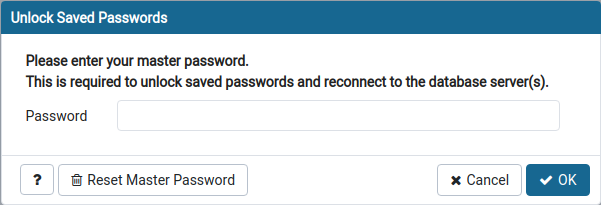

{}
Summary: in this tutorial, we will show you basic features of pgAdmin and how to install pgAdmin on your local system for using PostgreSQL.
{}

## Introduction

pgAdmin is one of the most popular Open Source administration and development platforms for PostgreSQL.

It's designed to meet the needs of both novice and experienced PostgreSQL users alike, providing a powerful graphical interface that simplifies the creation, maintenance and use of database objects.

It's supported on Linux, Mac OS X, and Windows. It supports all PostgreSQL features, from writing simple SQL queries to developing complex databases. It's designed to query an active database, allowing you to stay current with modifications and implementations. pgAdmin 4, the current version, can manage PostgreSQL 9.2 and above.

## Features

* Graphical query plan display
* Grant wizard for rapid updates to ACLs
* Procedural language debugger
* Auto-vacuum management
* Monitoring dashboard
* Backup, restore, vacuum and analyze on demand
* SQL/shell/batch job scheduling agent
* Auto-detection and support for objects discovered at run-time
* A live SQL query tool with direct data editing
* Support for administrative queries
* A syntax-highlighting SQL editor
* Redesigned graphical interfaces
* Powerful management dialogs and tools for common tasks
* Responsive, context-sensitive behavior
* Supportive error messages
* Helpful hints
* Online help and information about using pgAdmin dialogs and tools

## Installation

First, we need to import the repository key.

```
wget --quiet -O - https://www.postgresql.org/media/keys/ACCC4CF8.asc | sudo apt-key add -
```

And create the /etc/apt/sources.list.d/pgdg.list file. The distributions are called codename-pgdg. In our example should be pgdg. To determine the codename of your distribution you can run the lsb_release -c command.

```
sudo sh -c 'echo "deb http://apt.postgresql.org/pub/repos/apt/ `lsb_release -cs`-pgdg main" >> /etc/apt/sources.list.d/pgdg.list'
```

After this, you need to update the package lists, and install the pgadmin package:

```
sudo apt update
sudo apt install pgadmin4 pgadmin4-apache2 -y
```

Then, you only need to run the pgadmin4 command:

```
pgadmin4
```

## Configuration

Input master password to unlock and reconnect to database server(s)

</img>