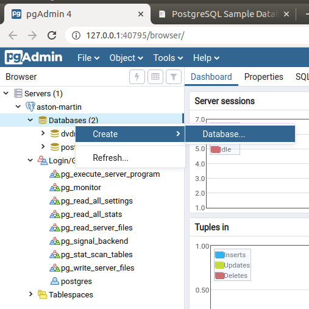
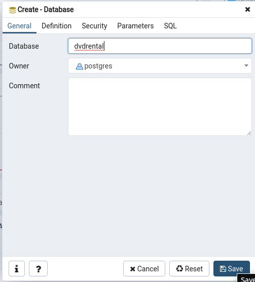
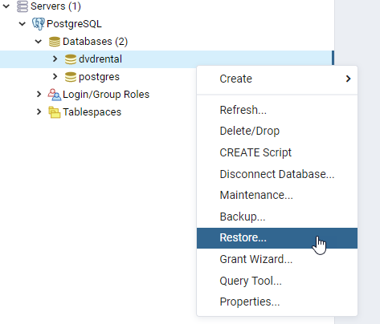
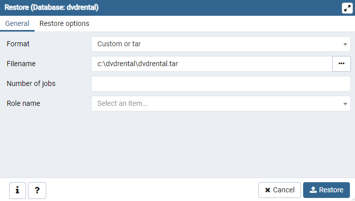

{}
Summary: in this tutorial, we will introduce you to a PostgreSQL sample database that you can use for learning and practice PostgreSQL.
{}

We will use the DVD rental database for demonstrating the features of PostgreSQL.

The DVD rental database represents the business processes of a DVD rental store. The DVD rental database has many objects including:

* 15 tables
* 1 trigger
* 7 views
* 8 functions
* 1 domain
* 13 sequences

## DVD Rental ER Model


## PostgreSQL Sample Database Tables

There are 15 tables in the DVD Rental database:

* actor – stores actors data including first name and last name.
* film – stores films data such as title, release year, length, rating, etc.
* film_actor – stores the relationships between films and actors.
* category – stores film’s categories data.
* film_category- stores the relationships between films and categories.
* store – contains the store data including manager staff and address.
* inventory – stores inventory data.
* rental – stores rental data.
* payment – stores customer’s payments.
* staff – stores staff data.
* customer – stores customers data.
* address – stores address data for staff and customers
* city – stores the city names.
* country – stores the country names.

## Download PostgreSQL sample database

You can download the PostgreSQL DVD Rental sample database via the following link:

<a type="button" href="dvdrental.zip">Download DVD Rental Sample Database</a>

The database file is in zipformat (dvdrental.zip) so you need to extract it to  dvdrental.tar before loading the sample database into the PostgreSQL database server.

## Download printable ER diagram

Besides the sample database, we also provide you with a printable ER diagram in PDF format. You can download and print the ER diagram for reference while practicing with PostgreSQL.

<a type="button" href="printable-postgresql-sample-database-diagram.pdf">Download the Printable ER Diagram</a>

This tutorial introduced you to a PostgreSQL sample database named DVD rental. We will use this database in our PostgreSQL tutorials so make sure that you have it on your server.

## Load PostgreSQL Sample Database

### Creating a new DVD rental database

Enter the following `CREATE DATABASE` statement to create a new dvdrental database.

```
CREATE DATABASE dvdrental;
```

PostgreSQL will create a new database named dvdrental.

Or, you can also create a new database by using pdAdmin4 as following picture:





### Load the DVD rental database using psql tool

First, unzip and copy the DVD rental database file to a folder e.g., `~/postgres_dump/dvdrental.tar`.

After that, use the `pg_restore` tool to load data into the dvdrental database:

```
pg_restore -U postgres -d dvdrental ~/postgres_dump/dvdrental.tar
```

In this command:

* The `-U postgres` specifies the postgresuser to login to the PostgreSQL database server.
* The `-d dvdrental` specifies the target database to load.

Finally, enter the password for the **postgres** user and press enter.

```
Password:
```

It takes seconds to load data stored in the dvdrental.tar file into the dvdrentaldatabase.

### Load the DVD Rental database using the pgAdmin

First, launch the **pgAdmin** tool and connect to the PostgreSQL server.

Next, right-click on the **dvdrental** database and choose **Restore...** menu item as shown in the following picture:



Then, provide the path to database file e.g., c:\dvdrental\dvdrental.tar and click the Restore button:



After that, wait for a few seconds to let the restoration process completes.

Finally, open the **dvdrental** database from object browser panel, you will see the tables in the **public** schema and other database objects as shown in the following picture:


We have shown you how to load the **dvdrental** sample database into the PostgreSQL database server for learning and practicing PostgreSQL.