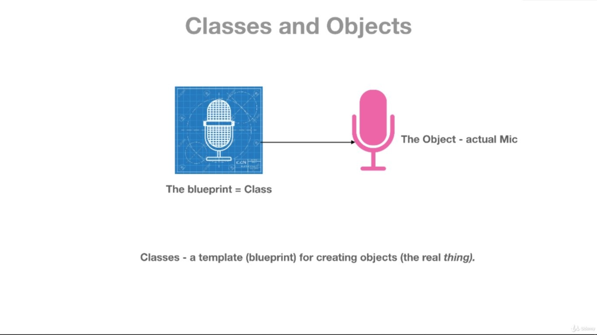
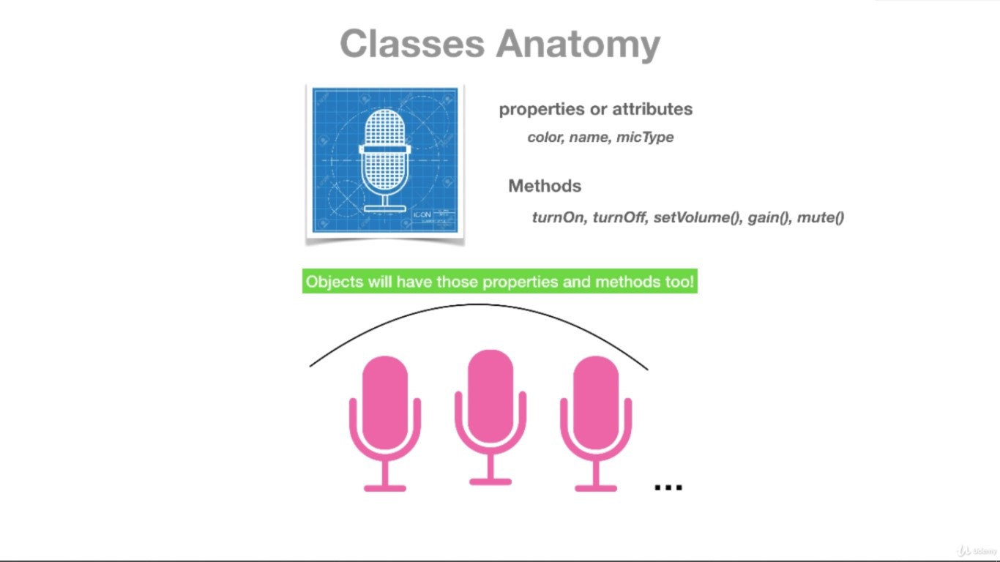

## Introduction

### Real-world example

What will we do if we want to create a Microphone?

The first step to create the microphone or any real-world thing is to create the **blueprint** of it.



In the blueprint, we define its properties and its functionality like:

* its color is its property
* its mic type is its property
* its model number is its property etc
* we can set the volume of the mic which is its functionality
* we can mute the mic which is its functionality
* we can turn it on or off which is its functionality etc
* After creating one blueprint, then by using that blueprint we can create a number of microphones. All microphones will have the same properties and functionality



### From a programming point of view

* Same concept here goes with Classes and Object’s terminology.
* The blueprint is called Class and the microphones or any other devices are called object here.
* Class is a blueprint from which we can create a number of objects. All objects will have access to all properties and methods. You can also modify access according to your need.

In Object Oriented Programming class is made up of four main things:

1. Properties (Instance Variables)
2. Methods (Functions)
3. Getters and Setters
4. Constructors

These all components are also called data members of the class.

## Syntax of Declaring Class

```
class class_name {
   // Properties (Instance Variables)
   // Constructor
   // Methods (Functions)
   // Getters and Setters
}
```

The **class** keyword is used to declare a class.

### Sample Code

```
class Mobile {
  String color;
  String brandName;

  String calling() {
    return "Mobile can do calling";
  }

  String musicPlay() {
    return "Mobile can play Music";
  }
}
```

## Syntax of Creating Object

```
var object_name = new class_name (arguments);
```

### Sample Code

```
var myMobile = new Mobile();
```

## Accessing Properties and Methods Of Class

* As I mentioned earlier all the properties and methods of a class can be accessed via the class’s object.
* For accessing the class’s properties and methods, we use ‘.’ (dot notation) also called a period.

### Syntax of accessing properties and methods

```
// Accessing Properties
   object_name.property_name;
// Accessing Methods
   object_name.method_name;
```

### Sample Code

```
// Accessing properties
    myMobile.color;
    myMobile.brandName;

// Accessing methods
    myMobile.calling();
    myMobile.musicPlay();
```

## Complete example

```
class Mobile {
  String color; // Property
  String brandName;
  String modelName;

  String calling() { // Method Creation
    return "Mobile can do calling";
  }

  String musicPlay() {
    return "Mobile can play Music";
  }

  String videoPlay() {
    return "Mobile can play video";
  }
}

main() {
  var myMobile = new Mobile(); // Creating Object

  myMobile.color = "White"; // Accessing Class's Property
  myMobile.brandName = "Apple Inc.";
  myMobile.modelName = "iPhone 14";
  
  print(myMobile.color);
  print(myMobile.modelName);
  print(myMobile.brandName);
  print(myMobile.calling());
  print(myMobile.musicPlay());
  print(myMobile.videoPlay());
}

Output
White
iPhone 14
Apple Inc.
Mobile can do calling
Mobile can play Music
Mobile can play video
```

## Constructor

### Definition

* A constructor is a special method (function) of a class that helps to create an object. As its name indicates `its constructs the new object`.
* It helps to create the object by initializing values to instance variables. So we can say that its main goal is to provide values to instance variables.

### How constructor is different from other methods of Class

There are some major differences between the normal method and constructor.

1. The constructor has the same name as the class.
2. The constructor doesn’t have a return type.
3. A constructor is automatically called when the object is created.
4. If we don’t specify a constructor, the default no-argument constructor will be created.

### Syntax of declaring constructor

```
class_name (arguments) {  //If there is a block of code.
  // Constructor body
}
```

or

```
class_name (arguments); // If there is no block of code.
```

### Sample Code

```
class Student{
  Student(int enNum){
    print(enNum);
  }
}

main(){
  var myStudent = new Student(15);
}

Output
15
```

### Named Constructor

* After seeing the advantages of the constructor you might want to create multiple constructors. But as we know constructor holds the name of the class. So, in that case, you might ask then how can we create multiple constructors and treat them differently. Then here comes a **Named Constructor** in the picture.
* By using named constructor you can create multiple constructors in the same class. Each constructor will have a unique name. So that you can identify each of them.

#### Syntax of defining a named constructor

```
class_name.constructor_name (arguments){
   // If there is block of code use this syntax
   // Statements
}
```

or

```
class_name.constructor_name (arguments);
   // If there is not block of code use this syntax
```

#### Sample code

```
class Employee {
  int empID;
  String empName;
  String empDept;

  Employee.ID(this.empID); // Named Constructor Creation

  Employee.name(this.empName);

  Employee.department(this.empDept);
}

main() {
  var myEmployee01 = new Employee.ID(15);
  var myEmployee02 = new Employee.department("Testing");
  var myEmployee03 = new Employee.name("Ashu");

  print(myEmployee01.empID);
  print(myEmployee02.empDept);
  print(myEmployee03.empName);
}

Output
15
Testing
Ashu
```