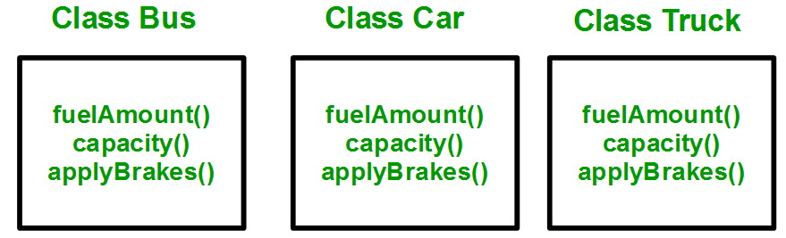
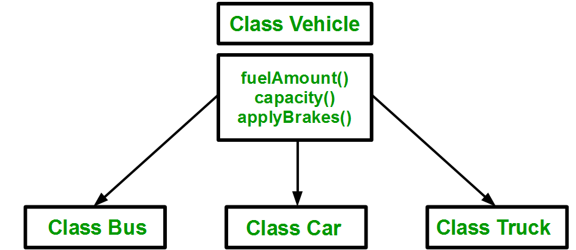
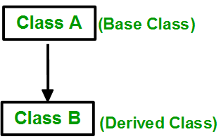
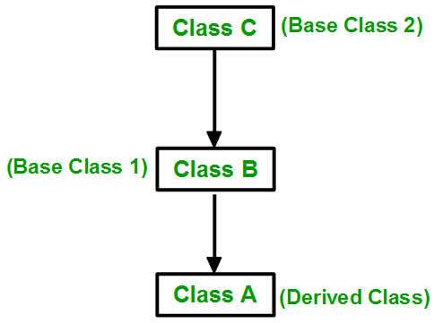

## Introduction

The capability of a class to derive properties and characteristics from another class is called Inheritance. It is ability of a program to create new class from an existing class.

* **Parent Class**- The class whose properties are inherited by child class is called Parent Class. Parent class is also known as base class or super class.
* **Child Class** - The class that inherits properties from another class is called child class. Child class is also known as derived class.

## Real-World Example

Consider a group of vehicles. You need to create classes for Bus, Car and Truck. The methods fuelAmount(), capacity(), applyBrakes() will be same for all of the three classes. If we create these classes avoiding inheritance then we have to write all of these functions in each of the three classes as shown in below figure:



You can clearly see that above process results in duplication of same code 3 times. This increases the chances of error and data redundancy. To avoid this type of situation, inheritance is used.

If we create a class `Vehicle` and write these three functions in it and inherit the rest of the classes from the vehicle class, then we can simply avoid the duplication of data and increase re-usability. Look at the below diagram in which the three classes are inherited from vehicle class:



Using inheritance, we have to write the functions only one time instead of three times as we have inherited rest of the three classes from base class(Vehicle).

## Syntax

```
class child_class extends parent_class {
  //body of child class
}
```

Child class inherits all the properties and methods except constructor from parent class.

## Types of Inheritance

Mainly there are three types of inheritance:

1. Single
2. Multiple - **Dart doesn’t support Multiple Inheritance**.
3. Multi-level

### Single Level Inheritance

In single inheritance, a class is allowed to inherit from only one class. i.e. one sub class is inherited by one base class only.



```
class Person{
  void showName(String name){
    print(name);
  }

  void showAge(int age){
    print(age);
  }
}

class Jay extends Person {}

main(){
  var jay = new Jay();

  jay.showName("JD");
  jay.showAge(20);
}

Output
JD
20
```

Here also remember that child class can have its own unique properties and methods too.

### Multi-Level Inheritance

In this type of inheritance, a derived class is created from another derived class.



```
class Person {
  void showName(String name) {
    print(name);
  }

  void showAge(int age) {
    print(age);
  }
}

class Jay extends Person {
  void showProfession(String profession) {
    print(profession);
  }

  void showNationality(String nationality) {
    print(nationality);
  }
}
//Derived class created from another derived class.
class Sanket extends Jay {} 

main() {
  var sanket = new Sanket();

  sanket.showName("Sanket");
  sanket.showAge(20);
  sanket.showNationality("Indian");
  sanket.showProfession("Engineer");
}

Output

Sanket
20
Indian
Engineer
```