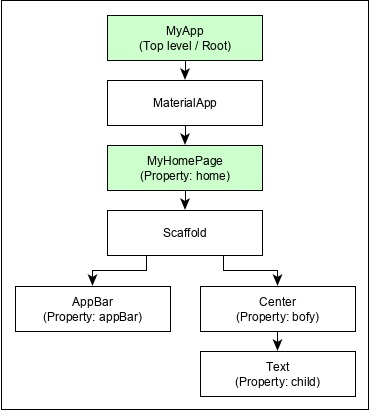
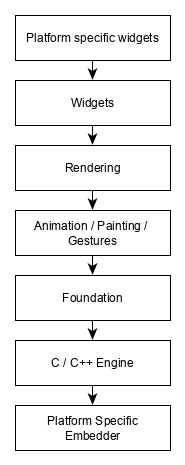

In this chapter, let us discuss the architecture of the Flutter framework.

## Widgets

The core concept of the Flutter framework is **In Flutter, Everything is a widget**. Widgets are basically user interface components used to create the user interface of the application.

In Flutter, the application is itself a widget. The application is the top - level widget and its UI is build using one or more children (widgets), which again build using its children widgets. This composability feature helps us to create a user interface of any complexity.

For example, the widget hierarchy of the hello world application (created in previous chapter) is as specified in the following diagram:

Here the following points are worth notable:

* `MyApp` is the user created widget and it is built using the Flutter native widget, `MaterialApp`.
* `MaterialApp` has a home property to specify the user interface of the home page, which is again a user created widget, `MyHomePage`.
* `MyHomePage` is built using another flutter native widget, `Scaffold`.
* `Scaffold` has two properties – body and appBar
* `body` is used to specify its main user interface and appBar is used to specify its header user interface
* `Header UI` is built using flutter native widget, `AppBar` and `Body UI` is built using `Center` widget.
* The `Center` widget has a property, `Child`, which refers the actual content and it is built using `Text` widget

## Gestures

Flutter widgets support interaction through a special widget, `GestureDetector`. `GestureDetector` is an invisible widget having the ability to capture user interactions such as tapping, dragging, etc., of its child widget. Many native widgets of Flutter support interaction through the use of `GestureDetector`. We can also incorporate interactive feature into the existing widget by composing it with the GestureDetector widget. We will learn the gestures separately in the upcoming chapters.

## Concept of State

Flutter widgets support *State maintenance* by providing a special widget, `StatefulWidget`. Widget needs to be derived from StatefulWidget widget to support state maintenance and all other widget should be derived from `StatefulWidget`. Flutter widgets are reactive in native. This is similar to reactjs and `StatefulWidget` will be auto re-rendered whenever its internal state is changed. The re-rendering is optimized by finding the difference between old and new widget UI and rendering only the necessary changes.

## Layers

The most important concept of Flutter framework is that the framework is grouped into multiple category in terms of complexity and clearly arranged in layers of decreasing complexity. A layer is built using its immediate next level layer. The top most layer is widget specific to Android and iOS. The next layer has all flutter native widgets. The next layer is Rendering layer, which is low level renderer component and renders everything in the flutter app. Layers goes down to core platform specific code.

The general overview of a layer in Flutter is specified in the below diagram:

## Summary

The following points summarize the architecture of Flutter:

* In Flutter, everything is a widget and a complex widget is composed of already existing widgets.
* Interactive features can be incorporated whenever necessary using `GestureDetector` widget.
* The state of a widget can be maintained whenever necessary using StatefulWidget widget.
* Flutter offers layered design so that any layer can be programmed depending on the complexity of the task.

We will discuss all these concepts in detail in the upcoming chapters.