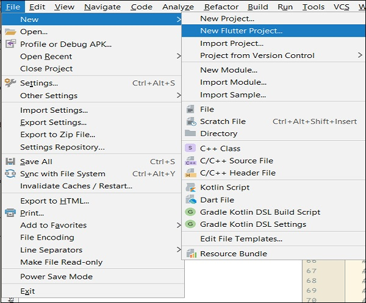
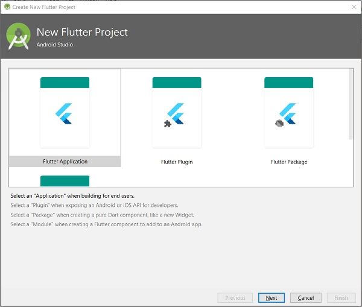
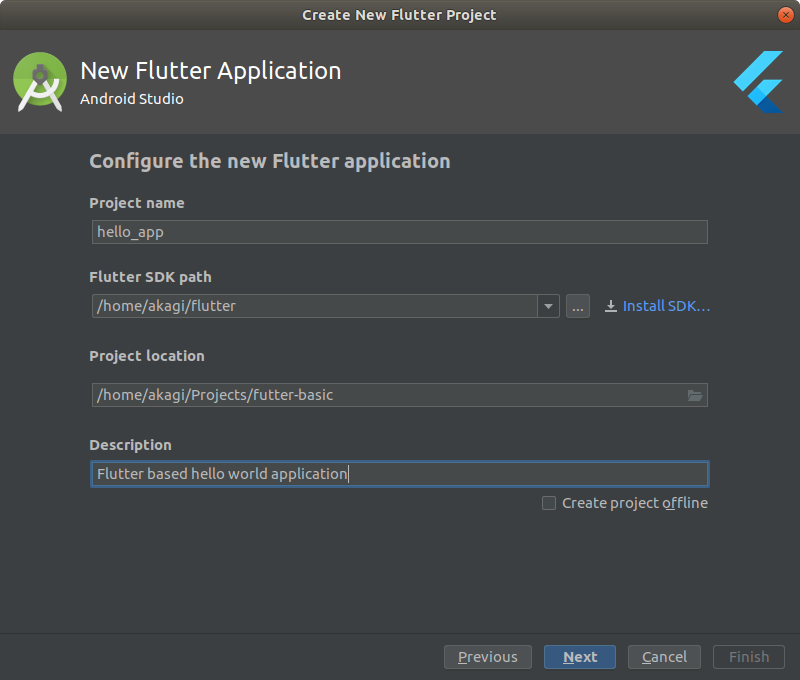
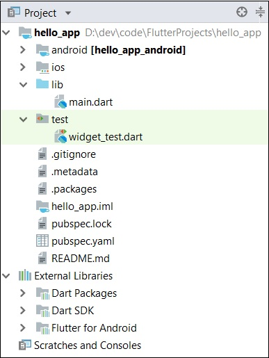
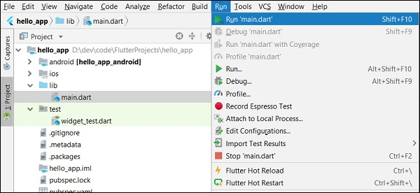
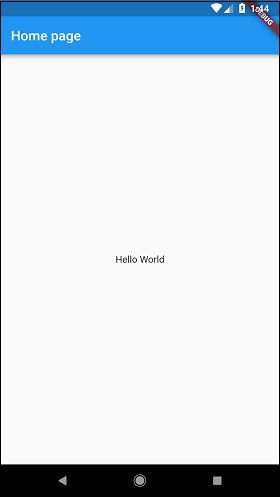

In this chapter, let us create a simple Flutter application to understand the **basics of creating a flutter application** in the Android Studio.

## Step 1 -- Open Android Studio

## Step 2 -- Create Flutter Project. For this, click File → New → New Flutter Project



## Step 3 − Select Flutter Application. For this, select Flutter Application and click Next



## Step 4 − Configure the application as below and click Next

* Project name: **hello_app**
* Flutter SDK Path: <path_to_flutter_sdk>
* Project Location: <path_to_project_folder>
* Description: Flutter based hello world application



## Step 5 − Configure Project

Set the company domain as flutterbasic.itv.com and click **Finish**.

Android Studio creates a fully working flutter application with minimal functionality. Let us check the structure of the application and then, change the code to do our task.

The structure of the application and its purpose is as follows −



Various components of the structure of the application are explained here −

* android − Auto generated source code to create android application
* ios − Auto generated source code to create ios application
* lib − Main folder containing Dart code written using flutter framework
* lib/main.dart − Entry point of the Flutter application
* test − Folder containing Dart code to test the flutter application
* test/widget_test.dart − Sample code
* .gitignore − Git version control file
* .metadata − auto generated by the flutter tools
* .packages − auto generated to track the flutter packages
* .iml − project file used by Android studio
* pubspec.yaml − Used by Pub, Flutter package manager
* pubspec.lock − Auto generated by the Flutter package manager, Pub
* README.md − Project description file written in Markdown format

## Step 6 − Replace the dart code in the lib/main.dart file with the below code

```
import 'package:flutter/material.dart';

void main() => runApp(MyApp());

class MyApp extends StatelessWidget {
  // This widget is the root of your application.
  @override
  Widget build(BuildContext context) {
      return MaterialApp(
        title: 'Hello World Demo Application',
        theme: ThemeData(
            primarySwatch: Colors.blue,
        ),
        home: MyHomePage(title: 'Home page'),
      );
  }
}
class MyHomePage extends StatelessWidget {
  MyHomePage({Key key, this.title}) : super(key: key);
  final String title;

  @override
  Widget build(BuildContext context) {
    return Scaffold(
        appBar: AppBar(
          title: Text(this.title),
        ),
        body: Center(
          child:
          Text(
              'Hello World',
          )
        ),
    );
  }
}
```

Let us understand the dart code line by line.

* Line 1 − imports the flutter package, *material*. The material is a flutter package to create user interface according to the Material design guidelines specified by Android.
* Line 3 − This is the entry point of the Flutter application. Calls runApp function and pass it an object of MyApp class. The purpose of the runApp function is to attach the given widget to the screen.
* Line 5-17 − Widget is used to create UI in flutter framework. StatelessWidget is a widget, which does not maintain any state of the widget. MyApp extends StatelessWidget and overrides its build method. The purpose of the build method is to create a part of the UI of the application. Here, build method uses MaterialApp, a widget to create the root level UI of the application. It has three properties - *title*, *theme* and *home*.
  - **title** is the title of the application
  - **theme** is the theme of the widget. Here, we set blue as the overall color of the application using ThemeData class and its property, primarySwatch.
  - **home** is the inner UI of the application, which we set another widget, MyHomePage
* Line 19 - 38 − *MyHomePage* is same as *MyApp* except it returns *Scaffold* Widget. *Scaffold* is a top level widget next to *MaterialApp* widget used to create UI conforming material design. It has two important properties, *appBar* to show the header of the application and *body* to show the actual content of the application. *AppBar* is another widget to render the header of the application and we have used it in *appBar* property. In *body* property, we have used *Center* widget, which centers it child widget. *Text* is the final and inner most *widget* to show the text and it is displayed in the center of the screen.

## Step 7 − Now, run the application using, Run → Run main.dart



## Step 8 − Finally, the output of the application is as follows

