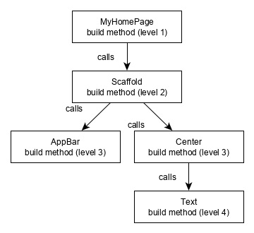
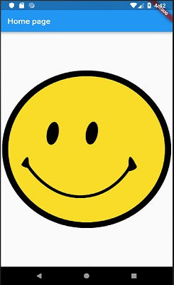
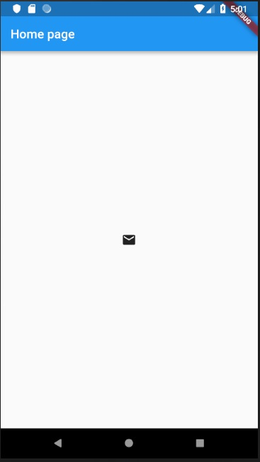

As we learned in the earlier chapter, widgets are everything in Flutter framework. We have already learned how to create new widgets in previous chapters.

In this chapter, let us understand the actual concept behind creating the widgets and the different type of widgets available in Flutter framework.

Let us check the Hello World application’s MyHomePage widget. The code for this purpose is as given below:

```
class MyHomePage extends StatelessWidget { 
  MyHomePage({Key key, this.title}) : super(key: key); 
  
  final String title; 
  @override 
  Widget build(BuildContext context) {
    return Scaffold( 
        appBar: AppBar(title: Text(this.title), ), 
        body: Center(child: Text( 'Hello World',)),
    );
  }
}
```

Here, we have created a new widget by extending *StatelessWidget*.

Note that the `StatelessWidget` only requires a single method *build* to be implemented in its derived class. The *build* method gets the context environment necessary to build the widgets through BuildContext parameter and returns the widget it builds.

In the code, we have used *title* as one of the constructor argument and also used *Key* as another argument. The *title* is used to display the *title* and *Key* is used to identify the widget in the build environment.

Here, the *build* method calls the build method of *Scaffold*, which in turn calls the build method of *AppBar* and *Center* to build its user interface.

Finally, *Center* build method calls *Text* build method.

For a better understanding, the visual representation of the same is given below:



## Widget Build Visualization

In Flutter, widgets can be grouped into multiple categories based on their features, as listed below:

* Platform specific widgets
* Layout widgets
* State maintenance widgets
* Platform independent / basic widgets

Let us discuss each of them in detail now.

### Platform specific widgets

Flutter has widgets specific to a particular platform - Android or iOS.

Android specific widgets are designed in accordance with Material design guideline by Android OS. Android specific widgets are called as **Material** widgets.

iOS specific widgets are designed in accordance with Human Interface Guidelines by Apple and they are called as **Cupertino** widgets.

Some of the most used material widgets are as follows:

* Scaffold
* AppBar
* BottomNavigationBar
* TabBar
* TabBarView
* ListTile
* RaisedButton
* FloatingActionButton
* FlatButton
* IconButton
* DropdownButton
* PopupMenuButton
* ButtonBar
* TextField
* Checkbox
* Radio
* Switch
* Slider
* Date & Time Pickers
* SimpleDialog
* AlertDialog

Some of the most used Cupertino widgets are as follows:


* CupertinoButton
* CupertinoPicker
* CupertinoDatePicker
* CupertinoTimerPicker
* CupertinoNavigationBar
* CupertinoTabBar
* CupertinoTabScaffold
* CupertinoTabView
* CupertinoTextField
* CupertinoDialog
* CupertinoDialogAction
* CupertinoFullscreenDialogTransition
* CupertinoPageScaffold
* CupertinoPageTransition
* CupertinoActionSheet
* CupertinoActivityIndicator
* CupertinoAlertDialog
* CupertinoPopupSurface
* CupertinoSlider

### Layout widgets

In Flutter, a widget can be created by composing one or more widgets. To compose multiple widgets into a single widget, Flutter provides large number of widgets with layout feature. For example, the child widget can be centered using Center widget.

Some of the popular layout widgets are as follows:

* Container − A rectangular box decorated using `BoxDecoration` widgets with background, border and shadow.
* Center − Center its child widget.
* Row − Arrange its children in the horizontal direction.
* Column − Arrange its children in the vertical direction.
* Stack − Arrange one above the another.

We will check the layout widgets in detail in the upcoming **Introduction to layout widgets** chapter.

### State maintenance widgets

In Flutter, all widgets are either derived from StatelessWidget or StatefulWidget.

Widget derived from `StatelessWidget` does not have any state information but it may contain widget derived from `StatefulWidget`. The dynamic nature of the application is through interactive behavior of the widgets and the state changes during interaction. For example, tapping a counter button will increase / decrease the internal state of the counter by one and reactive nature of the Flutter widget will auto re-render the widget using new state information.

We will learn the concept of StatefulWidget widgets in detail in the upcoming **State management** chapter.

### Platform independent / basic widgets

Flutter provides large number of basic widgets to create simple as well as complex user interface in a platform independent manner. Let us see some of the basic widgets in this chapter.

#### Text

Text widget is used to display a piece of string. The style of the string can be set by using style property and TextStyle class. The sample code for this purpose is as follows

```
Text('Hello World!', style: TextStyle(fontWeight: FontWeight.bold))
```

Text widget has a special constructor, Text.rich, which accepts the child of type `TextSpan` to specify the string with different style. TextSpan widget is recursive in nature and it accepts `TextSpan` as its children. The sample code for this purpose is as follows:

```
Text.rich( 
  TextSpan( 
    children: <TextSpan>[ 
        TextSpan(text: "Hello ", style:  
        TextStyle(fontStyle: FontStyle.italic)),  
        TextSpan(text: "World", style: 
        TextStyle(fontWeight: FontWeight.bold)),  
    ], 
  ), 
)
```

The most important properties of the Text widget are as follows:

* maxLines, int − Maximum number of lines to show
* overflow, TextOverFlow − Specify how visual overflow is handled using TextOverFlow class
* style, TextStyle − Specify the style of the string using TextStyle class
* textAlign, TextAlign − Alignment of the text like right, left, justify, etc., using TextAlign class
* textDirection, TextDirection − Direction of text to flow, either left-to-right or right-to-left

#### Image

Image widget is used to display an image in the application. Image widget provides different constructors to load images from multiple sources and they are as follows:

* Image − Generic image loader using `ImageProvider`
* Image.asset − Load image from flutter project’s assets
* Image.file − Load image from system folder
* Image.memory − Load image from memory
* Image.Network − Load image from network

The **easiest** option to load and display an image in Flutter is by including the image as **assets** of the application and load it into the widget on demand.

* Create a folder, **assets** in the project folder and place the necessary images.
* Specify the **assets** in the `pubspec.yaml` as shown below:
  ```
  flutter:
    assets:
      - assets/smiley.png
  ```

* Now, load and display the image in the application.

  ```
  Image.asset('assets/smiley.png')
  ```

* The complete source code of `MyHomePage` widget of the hello world application and the result is as shown below:

  ```
  class MyHomePage extends StatelessWidget {
    MyHomePage({Key key, this.title}) : super(key: key); 
    final String title; 

    @override 
    Widget build(BuildContext context) {
        return Scaffold( 
          appBar: AppBar( title: Text(this.title), ), 
          body: Center( child: Image.asset("assets/smiley.png")),
        ); 
    }
  }
  ```

The loaded image is as shown below:



The most important properties of the Image widget are as follows:

* image, ImageProvider − Actual image to load
* width, double − Width of the image
* height, double − Height of the image
* alignment, AlignmentGeometry − How to align the image within its bounds

#### Icon

**Icon** widget is used to display a glyph from a font described in `IconData` class. The code to load a simple email icon is as follows:

```
Icon(Icons.email)
```

The complete source code to apply it in hello world application is as follows:

```
class MyHomePage extends StatelessWidget { 
  MyHomePage({Key key, this.title}) : super(key: key); 
  final String title; 

  @override 
  Widget build(BuildContext context) {
    return Scaffold(
        appBar: AppBar(title: Text(this.title),),
        body: Center( child: Icon(Icons.email)),
    );
  }
}
```

The loaded icon is as shown below:

