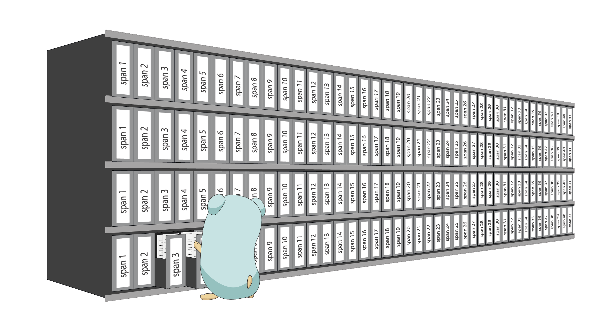

{}
Memory Management and Allocation in Golang
{}

</img>

Go memory management is automatically done by the standard library from the allocation of the memory to its collection when it is not used anymore. Although the developer does not have to deal with it, the underlying management done by Go is well optimized and full of interesting concepts.

## Allocation on the heap

The memory management is designed to be fast in a concurrent environment and integrated with the garbage collector. Let’s start with a simple example:

## Reference

https://medium.com/a-journey-with-go/go-memory-management-and-allocation-a7396d430f44