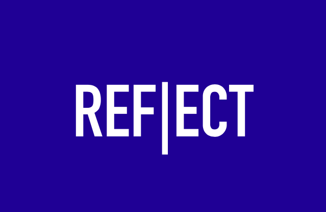
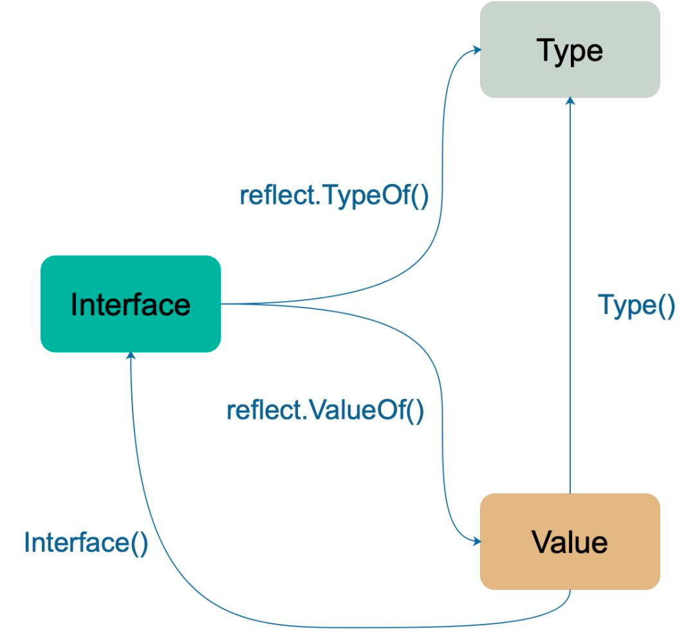
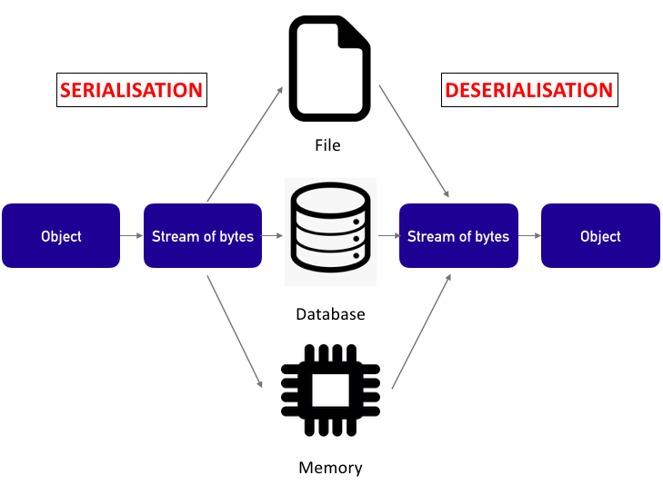

{}
What are the pros and cons of this helpful method?
{}

</img>

Go is a strongly and statically typed programming language. However, some features in Go make it seemed to be dynamically typed. For instance, if you are not sure what type you’ll be receiving, you may implement interface type for an open-ended type.

Remember that only interface has reflect.

Note that interface allows polymorphism in Go. No particular implementation is enforced. It could be string, int64, float32, or even a collection ( array/ map). When a computer runs a code (runtime), reflect helps to examine, introspect, and modify its own structure and behaviour. This process allows us to know the type of an object and memory structure during runtime.

## Why do we need `reflect`?

1. Unable to pre-define parameter type. (Usually happens in exposing open API)

2. Function is dynamically executed depending on parameter input. 

## Disadvantages of `reflect`

1. Affects code readability.

2. Unable to detect errors during code compilation. As a statically typed language, the Go compiler will pre-check some types of error during compilation. When type is not explicitly defined in interface, the server is at risk of panicking after running the code.

3. Decreases the overall performance. Using reflect requires the server to do additional work to find the type behind a parameter. Therefore, try to avoid interface in important parameters.

## Two Fundamental Functions of reflect

The two main functions of reflect are ```reflect.Type``` and ```reflect.Value```.

In short, ```reflect.Type``` provides information on the type of parameter, while ```reflect.Value``` combines ```_type``` and ```data```, which allows developers to read or edit the value of the parameter.

```
func TypeOf(i interface{}) Type
func ValueOf(i interface{}) Value
```

Then, you may use ```fmt.Printf()``` and ```%T``` as formatting params to get the result of ```reflect.TypeOf``` as follows:

```
fmt.Printf("%T", 3) //int
```

Under ```reflect.Type```, ```toType``` is a method to change the type.

```
func toType(t * rtype) Type {
  if t == nil {
    return nil
  }
  return t
}
```

On the other hand, ```reflect.Value``` returns the variable stored in interface{}. It has many methods including ```SetLen(n int)``` (to set length of variable), ```SetMapIndex(key, val Value)``` (to set kv in map), ```Int()``` (to get value with int type), ```TrySend(x reflect.Value)``` (to send data to a channel), etc. For full documentation, please refer to src/reflect/value.go.

</img>
<p class="center">Type and Value of reflect in golang</p>

## Three Rules in reflect

From the Go official site:

1. Reflection goes from interface value to reflection object.

2. Reflection goes from reflection object to interface value.

3. To modify a reflection object, the value must be settable.

A typical example is as follows:

```
var x float64 = 3.4
v := reflect.ValueOf(x)
v.SetFloat(7.1) // Error: will panic
```

The server will panic if you run the code above, simply because ```v``` is not ```x``` itself, but merely a copy of x. Hence, any modification of v is prohibited.

So, we need a pointer to solve the issue:

```
var x float64 = 3.4
y := reflect.ValueOf(&x)
fmt.Println(“type of y”, y.Type()) // *float64
fmt.Println(“settability of y:”, y.CanSet()) // false
```

```y``` is still not representing ```x```. You need ```y.Elem()``` to apply the modification to it:

```
z := y.Elem()
z.SetFloat(7.1)
fmt.Println(z.Interface()) // 7.1
fmt.Println(x) // 7.1
```

Note that the pointer will change the pointed variable too; in our context, the ```x```.

## Applications of reflect

```reflect``` is widely used in object serialisation, fmt-related functions, ORM (Object Relational Mapping), etc.

### 1. JSON Serialisation

</img>

In Go, there are two functions to serialise and deserialise:

```
func Marshal(v interface{})([]byte, error)
func Unmarshal(data []byte, v interface{}) error
```

Both functions have ```interface{}``` type in the parameters, so ```reflect``` is required when we call these functions so that we can know all the values and types of the params and hence apply ```get``` or ```set``` methods.

### 2. DeepEqual Function

In debugging a function, often we need to justify whether two variables are exactly the same. For instance, to determine whether all elements in the slice are the same or to check that the key and value of a map are equal. This can be realised through ```DeepEqual``` function.

```
func DeepEqual(x, y interface{}) bool
```

```DeepEqual()``` has two interface params. You may input any value into it, and it will return true or false after checking whether the two variables are deeply equal.

Wait, what is deeply equal? Let’s see an example here:

```
type FirstInt int
type SecondInt int

func main() {
  m := FirstInt(1)
  n := SecondInt(1)
  
  fmt.Println(reflect.DeepEqual(m, n)) // false
}
```

In the example above, m and n are both int and have a value of 1. However, the dynamic type of these two variables is different. First variable m has a type of FirstInt, and the second variable n has a type of SecondInt. Therefore, they are not deeply equal.

## Conclusion

Go, as a static language, will have certain limitations in flexibility as compared to a dynamic language like Python. But, by using reflect to give abilities similar to those of a dynamic language, you can fluidly get the type or value of parameters when writing in Go.