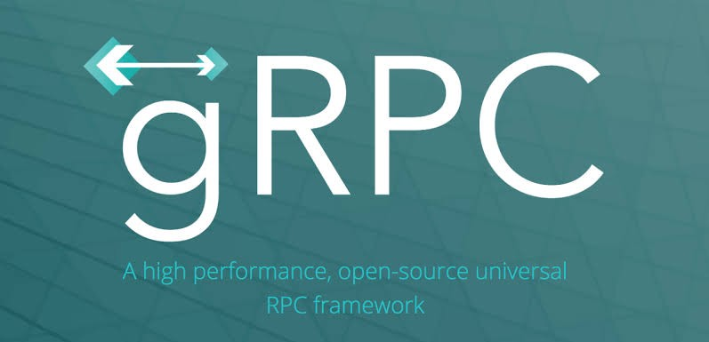

</img>

gRPC is a complex topic, and my aim is to provide a gentle introduction and provide the intuition behind the concepts. We’ll first review the basics and then the concepts of gRPC. In the end, we will see a practical example in Golang.

## What is RPC?

**RPC** stands for *'Remote Procedure Call'*.

**RPC** is an old concept. Since the 70s and 80s, this technique has been used in developing distributed systems. RPC is defined as follows:

## References

https://levelup.gitconnected.com/understanding-grpc-a-practical-application-in-go-and-python-f3003c9158ef